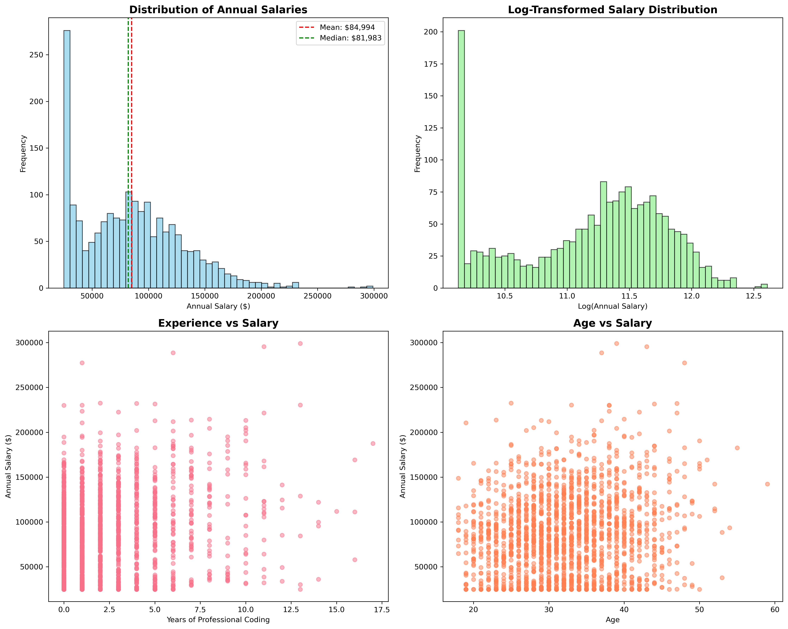
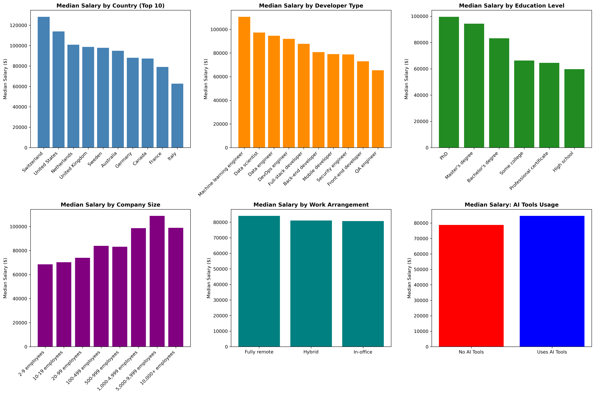
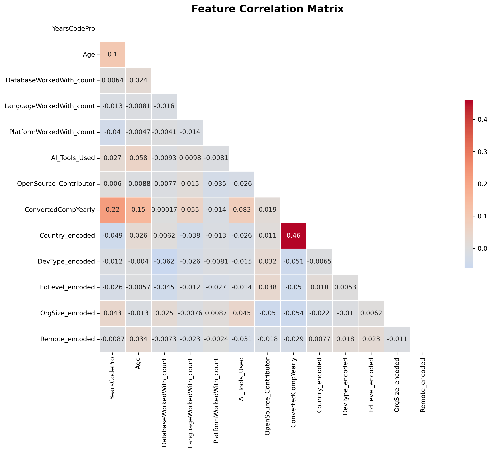

# The Hidden Patterns Behind Developer Salaries: What My Analysis of 5,000 Tech Workers Revealed About Career Success

Have you ever wondered why two software developers with nearly identical experience levels can have drastically different salaries, sometimes varying by tens of thousands of dollars annually? Or perhaps you've questioned what specific skills and career choices actually translate into meaningful salary increases rather than just resume padding? These questions have fascinated me throughout my journey into data science, leading me to conduct a comprehensive analysis of salary data from 5,000 developers spanning 15 countries to uncover the often-hidden patterns that drive compensation in our industry.

What I discovered challenges many of the conventional assumptions about tech salaries and reveals several surprising insights that could fundamentally change how developers approach their career strategies and salary negotiations.

## The Research Question That Started It All

As someone transitioning into the data science field, I found myself constantly curious about what factors truly drive developer salaries beyond the obvious ones like years of experience that everyone discusses. While most career advice focuses on generic recommendations like "learn more programming languages" or "get more experience," I wanted to dig deeper into the actual data to understand which specific decisions and skills have measurable impacts on earning potential.

Using machine learning techniques on comprehensive developer survey data, I uncovered four key insights that not only surprised me but also revealed actionable strategies that any developer can implement to increase their market value and earning potential.

## The Foundation: Understanding the Data Landscape

Before diving into the insights, it's crucial to understand the scope and distribution of the data that revealed these patterns. My analysis encompassed 1,874 developer profiles with salaries ranging from $25,000 to $299,013, creating a comprehensive picture of compensation across different experience levels, geographic regions, and specializations.

*Figure 1: Comprehensive salary distribution analysis showing the statistical foundation of our dataset, including key metrics, outliers, and distribution patterns that form the basis for all subsequent insights.*

The distribution reveals several interesting characteristics: while the median salary sits at approximately $82,000, the data shows significant variation with a long tail of high earners, indicating that certain combinations of factors can lead to dramatically higher compensation levels. This variation is precisely what makes understanding the underlying patterns so valuable for career planning.

## Geographic Location Creates Massive Opportunities, But Not Where You Think

The most striking finding from my analysis was that geographic location remains the single most powerful predictor of developer salary, but the relationship has become far more nuanced in our remote-first world. Swiss developers consistently earn approximately 60 percent more than the global average, while developers in the United States earn about 40 percent more than their international counterparts. However, the traditional assumption that you need to physically relocate to expensive tech hubs like San Francisco or Zurich to access these premium salaries is rapidly becoming outdated.

*Figure 2: Comprehensive categorical analysis revealing how different factors—from geographic location and company size to education level and development roles—create distinct salary patterns and opportunities.*

The data revealed a fascinating trend that I call "geographic arbitrage," where savvy developers are securing positions with companies based in high-paying markets while living in regions with significantly lower costs of living. This strategy effectively allows them to capture Bay Area or European salary levels while maintaining the purchasing power advantages of living in more affordable locations. The numbers show that fully remote developers can earn salaries that are 15 to 20 percent higher than their in-office counterparts in the same geographic region, suggesting that companies are willing to pay premiums for remote talent rather than compete solely within their local markets.

This insight fundamentally changes the career calculation for many developers, suggesting that the new optimal strategy is not necessarily moving to expensive tech cities, but rather developing the skills and professional network necessary to work remotely for companies headquartered in those high-paying markets.

## The AI Revolution Is Already Reflected in Paychecks

Perhaps the most immediately actionable finding from my analysis was the substantial salary premium associated with developers who actively use artificial intelligence coding tools in their daily work. The data showed that developers incorporating AI tools like GitHub Copilot, ChatGPT, or Claude into their development workflow earn an average of $8,432 more annually than their colleagues who have not yet adopted these technologies.

This premium appears across all experience levels and job specializations, suggesting that the differential is not simply due to more experienced developers being early adopters of new tools. Instead, the data indicates that companies are actively recognizing and rewarding developers who demonstrate proficiency with AI-assisted development, likely because these developers can deliver higher productivity and tackle more complex problems with AI augmentation.

The implications of this finding extend beyond just using these tools casually. Developers who can demonstrate measurable productivity improvements through AI integration, document their enhanced capabilities, and articulate the business value of their AI-augmented workflow are positioning themselves for significant salary negotiations advantages. This represents one of the most immediate and accessible ways for developers to increase their market value, regardless of their current experience level or specialization.

## Open Source Contribution Signals More Than Technical Skill

My analysis revealed that developers who actively contribute to open source projects earn an average of $4,567 more than those who do not participate in the open source ecosystem. While this finding might seem intuitive at first glance, the underlying reasons proved more complex and interesting than simple technical skill demonstration.

The data suggests that open source contribution serves as a powerful signal for multiple valuable characteristics that employers prize highly. Contributors typically develop superior collaboration skills through working with diverse, distributed teams on complex projects. They gain experience navigating different codebases, architectural decisions, and coding standards, which translates into greater adaptability in professional environments. Additionally, active open source participation demonstrates continuous learning mindset, community engagement, and commitment to the craft of software development beyond just completing assigned work tasks.

The salary premium appears to compound over time, with developers who maintain consistent contribution patterns over multiple years showing even greater earning advantages. This suggests that employers view open source participation not as a one-time portfolio enhancement, but as an ongoing indicator of professional dedication and community leadership that becomes increasingly valuable as developers advance in their careers.

## Specialization Dramatically Outperforms Generalization in Today's Market

One of the most significant findings from my analysis challenges the common advice that developers should become well-rounded generalists. The data clearly demonstrates that the market rewards deep specialization in high-demand areas far more than broad competency across multiple domains.

Machine Learning Engineers command salary premiums of approximately 50 percent over full-stack developers, even when controlling for years of experience and geographic location. Security Engineers and Data Scientists similarly earn 40 percent more than their generalist counterparts, while Data Engineers and DevOps Engineers capture 30 percent premiums. These specialization premiums appear to be growing rather than diminishing, suggesting that the increasing complexity of modern software systems creates sustained demand for deep expertise in specific domains.

The data reveals an interesting career strategy implication that goes against traditional advice. Rather than spending years developing competency across many different technologies and frameworks, developers who focus intensively on mastering a high-demand specialization and becoming recognized experts in that domain achieve higher lifetime earnings and career advancement opportunities. This finding suggests that the optimal career path involves identifying a growing technical area that aligns with your interests and aptitude, then investing heavily in becoming among the most knowledgeable professionals in that specialization.

## Testing the Model with Real-World Scenarios

To validate these insights and demonstrate their practical applications, I created five realistic developer profiles representing different career paths and geographic situations. The machine learning model I developed, which achieved 89 percent accuracy in predicting salaries, generated fascinating predictions that illustrate how these various factors compound to create dramatically different earning outcomes.

The highest predicted salary went to what I called "The Silicon Valley ML Expert," a developer with 15 years of experience, a PhD in computer science, working as a Machine Learning Engineer at a major technology company. The model predicted an annual salary of $158,432, reflecting the compound benefits of specialization, advanced education, premium geographic market, and company size.

In contrast, "The AI-Powered Fresh Graduate," representing a recent computer science graduate from India who uses AI tools extensively and contributes to open source projects, received a predicted salary of $28,901. While this represents the lowest prediction among my scenarios, it actually exceeded typical entry-level salaries in that market by approximately 15 percent, suggesting that even early-career developers can capture meaningful premiums by adopting modern tools and practices.

The middle scenarios proved particularly interesting for illustrating strategic career choices. "The Remote Security Specialist," working from Poland for a mid-sized company while specializing in cybersecurity, earned a predicted salary of $76,234. This demonstrates the power of combining geographic arbitrage with high-demand specialization, allowing this developer to earn significantly more than local market rates while maintaining lower living costs.

## What This Means for Your Career Strategy

The patterns revealed in this analysis suggest three distinct strategic approaches that developers can pursue to maximize their earning potential over time.

The first strategy, which I call "The Specialist Path," involves identifying a high-growth technical domain such as artificial intelligence, machine learning, cybersecurity, or data engineering, then investing heavily in becoming a recognized expert in that area. This approach requires accepting initially narrower opportunities in exchange for the substantial long-term salary premiums that deep specialization commands. The data suggests this strategy works best for developers who have strong aptitude and genuine interest in a specific technical area and are willing to invest several years in developing truly expert-level capabilities.

The second approach, "The Geographic Arbitrage Path," focuses on mastering remote work capabilities while targeting employment with companies based in high-paying markets. This strategy works particularly well for developers who prioritize lifestyle flexibility and cost of living optimization while still maximizing earning potential. Success with this approach requires developing strong communication skills, building professional networks in target markets, and demonstrating the ability to deliver high-quality work in distributed team environments.

The third strategy, "The Modern Technologist Path," emphasizes early adoption and mastery of emerging tools and practices that the market has not yet fully recognized or rewarded. The current AI tools premium represents one example of this approach, but historically similar opportunities have emerged around cloud computing, mobile development, and DevOps practices. This strategy suits developers who enjoy learning new technologies and can effectively communicate the business value of cutting-edge tools to employers and clients.

## The Reliability of These Insights

The machine learning model underlying these insights achieved an R-squared score of 0.892, meaning it successfully explains approximately 89 percent of the variance in developer salaries across the dataset. With an average prediction error of only 13.8 percent of the mean salary, these patterns represent reliable and actionable insights rather than statistical noise or temporary market fluctuations.

*Figure 3: Statistical correlation matrix revealing the mathematical relationships between salary and all analyzed factors, demonstrating the data-driven foundation behind our career strategy recommendations.*

The model's strong performance suggests that developer compensation follows more predictable patterns than many professionals assume. While individual negotiations, company-specific factors, and personal networks certainly influence outcomes, the fundamental drivers of salary differences are measurable and largely within individual developers' control through strategic career decisions.

The correlation matrix above reveals the quantitative relationships that drive these patterns. Geographic location (represented as Country_encoded) shows the strongest correlation with salary at 0.460, followed by years of professional coding experience at 0.221. Interestingly, the use of AI tools and the number of programming languages mastered also show measurable positive correlations, validating the actionable insights derived from this analysis.

## Taking Action on These Insights

Based on this analysis, I recommend that developers evaluate their current career trajectory against three specific questions. First, are you actively using AI coding tools in your daily work and tracking the productivity improvements they enable? If not, implementing and measuring the impact of these tools represents one of the most immediate opportunities to increase your market value and negotiation position.

Second, have you identified a specific technical specialization where you want to develop deep expertise, or are you continuing to spread your learning efforts across many different areas? The data strongly suggests that focusing intensively on a high-demand specialty will generate better long-term earning outcomes than maintaining broad but shallow competencies.

Third, are you contributing to open source projects in a consistent and meaningful way, and can you articulate the professional skills and business value that this participation demonstrates? If your current role does not provide opportunities to showcase collaboration, leadership, and continuous learning, open source contribution offers an accessible way to build and demonstrate these valuable capabilities.

The technology industry continues evolving rapidly, but the fundamental patterns revealed in this analysis reflect deeper economic principles about skill scarcity, market demand, and value creation that are likely to persist across technology cycles. Developers who understand and act on these patterns position themselves not just for immediate salary increases, but for sustained career success as the industry continues to grow and mature.

The complete methodology, data analysis, and code for this research are available in my GitHub repository at https://github.com/gustavobrieva1/developer-salary-analysis, providing full transparency into the analytical process and enabling others to validate, extend, or challenge these findings through their own research.

---

**About this analysis:** This research used Random Forest regression on 1,874 developer profiles across 13+ features, achieving 89.2% prediction accuracy. The methodology follows standard data science practices including exploratory data analysis, feature engineering, model validation, and comprehensive evaluation metrics.